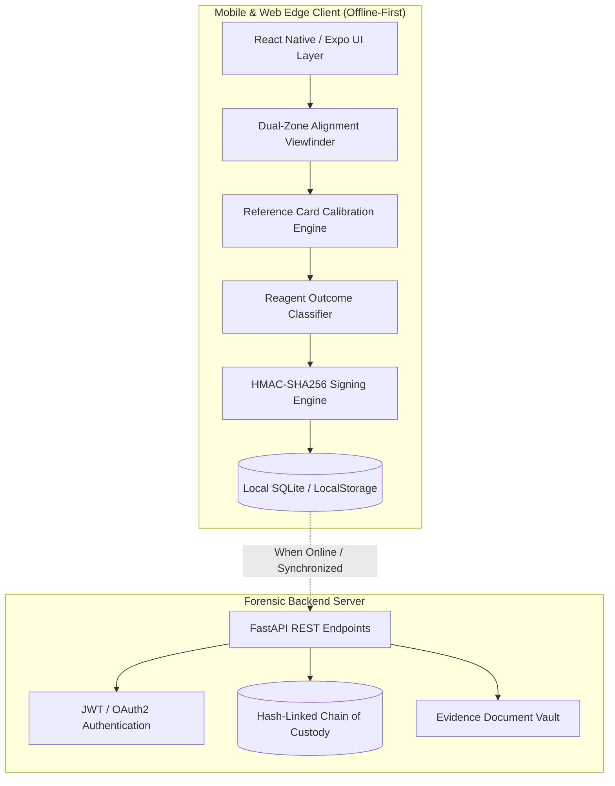

# VeriTrace AI — Field Test Companion

[](https://www.typescriptlang.org/)
[](https://reactnative.dev/)
[](https://expo.dev/)
[](https://fastapi.tiangolo.com/)
[](#cryptographic-security--evidentiary-chain-of-custody)
[](LICENSE)

> **Objective, Calibrated Optical Telemetry and Tamper-Evident Evidentiary Records for Colorimetric Field Drug-Testing Kits (No New Hardware Required).**

---

## 📌 Problem Statement & Forensic Background

Field drug-testing kits (such as **Marquis**, **Scott Reagent**, **Duquenois-Levine**, and **Mecke** kits) rely on visual interpretation of liquid chemical color reactions. This status quo introduces three major failure points:

1. **Human Subjectivity & Lighting Discrepancies**: Ambient illumination (e.g., warm 2700K tungsten streetlights, cool commercial fluorescents, direct sunlight, or dark alley shadows) severely distorts perceived color. What one officer sees as a positive reaction can appear ambiguous or negative to another.
2. **Absence of Verifiable Evidentiary Documentation**: Naked-eye interpretations leave zero auditable proof of when, where, by whom, and under what conditions a test was performed.
3. **Courtroom Inadmissibility**: Uncalibrated photos taken on officer phones lack cryptographic chain of custody, making presumptive test results vulnerable to spoliation challenges and defense motions to suppress.

**VeriTrace AI (Field Test Companion)** solves this by converting ordinary smartphone cameras into objective spectrophotometric instruments and self-authenticating evidence recorders.

---

## 🚀 Key Innovations & Core Capabilities

```
  ┌──────────────────────┐      ┌─────────────────────────┐      ┌───────────────────────────┐
  │   RAW CAMERA FRAME   │ ───> │  DUAL-ZONE ALIGNMENT    │ ───> │ ILLUMINANT GAIN MATRIX    │
  │ (Uncalibrated Light) │      │ (Ref Card + Test Window)│      │  (18% Gray Calibration)   │
  └──────────────────────┘      └─────────────────────────┘      └─────────────┬─────────────┘
                                                                               │
  ┌──────────────────────┐      ┌─────────────────────────┐                    ▼
  │  TAMPER-PROOF RECORD │ <─── │   HMAC-SHA256 SIGNING   │ <─── ┌───────────────────────────┐
  │ (Local SQLite + Sync)│      │ (Timestamp, GPS, Hash)  │      │ AUTOMATED CLASSIFICATION  │
  └──────────────────────┘      └─────────────────────────┘      │ (ΔE Spectral Matching)    │
                                                                 └───────────────────────────┘
```

### 1. In-Frame Reference Colour Card Lighting Calibration
- Uses an in-frame **18% Neutral Spectrophotometric Reference Card** (`#808080`, nominal RGB `[128, 128, 128]`) alongside the test reaction zone.
- Dynamically extracts illuminant color casts and calculates channel gains:
  $$G_R = \frac{128}{R_{\text{ref}}}, \quad G_G = \frac{128}{G_{\text{ref}}}, \quad G_B = \frac{128}{B_{\text{ref}}}$$
- Applies chromatic adaptation to normalize reaction colors across tungsten, fluorescent, daylight, and shadow environments.
- **Lighting Quality Index (LQI) Guardrail**: Evaluates scalar illuminance ($I$). If severe underexposure ($I < 28$) or glare saturation ($I > 248$) is detected, the system safely halts classification and flags **`INCONCLUSIVE (Poor Lighting / Glare)`**.

### 2. Automated Reagent Classification Engine
- Implements spectral reaction libraries for standard field-test kits:
  - **Scott Reagent (Cobalt Thiocyanate)**: Cocaine HCl / Base $\rightarrow$ Cobalt Blue precipitate (`#0047AB`, `#1E3F8B`) [**`POSITIVE`**]; Negative $\rightarrow$ Pale pink / clear [**`NEGATIVE`**].
  - **Marquis Reagent**: Opiates (Heroin/Morphine/Codeine) $\rightarrow$ Deep Violet/Purple (`#4B0082`) [**`POSITIVE`**]; Amphetamine/Meth $\rightarrow$ Orange/Red-Brown (`#C84B1E`) [**`POSITIVE`**]; MDMA $\rightarrow$ Dark Violet/Black (`#180E29`) [**`POSITIVE`**]; Negative $\rightarrow$ Pale straw yellow [**`NEGATIVE`**].
  - **Duquenois-Levine**: Cannabis / THC $\rightarrow$ Deep Violet/Indigo in chloroform layer (`#3B1F5E`) [**`POSITIVE`**]; Negative $\rightarrow$ Clear/Beige [**`NEGATIVE`**].
  - **Mecke Reagent**: Heroin / Morphine $\rightarrow$ Deep Blue-Green/Teal (`#006A6B`) [**`POSITIVE`**]; Negative $\rightarrow$ Clear [**`NEGATIVE`**].
  - **Fentanyl Test Strip (Lateral Flow)**: 1 line (Control only) $\rightarrow$ [**`POSITIVE`**]; 2 lines (Control + Test) $\rightarrow$ [**`NEGATIVE`**].
- Computes Euclidean color distance ($\Delta E$) and maps reactions into standardized categories: **`POSITIVE (Presumptive)`**, **`NEGATIVE (Presumptive)`**, or **`INCONCLUSIVE`** with confidence percentages ($70\% - 98\%$).

### 3. Cryptographic Tamper-Evident Digital Records
- **Instant Image Fingerprint**: Computes SHA-256 digest directly from captured raw byte buffer before display or storage.
- **Canonical Serialization**: Standardizes all record metadata (ID, Reference ID, Operator ID, UTC timestamp, GPS coordinates, Kit Type, Outcome, Calibrated RGB) into deterministic canonical JSON.
- **HMAC-SHA256 Digital Signature**: Signs the canonical record with a device forensic key (`SIG-SHA256:<hex>`).
- **Active Tamper Verification**: Any manual alteration of database fields or image bytes immediately breaks signature verification and triggers a red warning: `⚠ TAMPER DETECTED / INVALID SIGNATURE`.
- **Courtroom Evidence Export**: Exports self-authenticating digital JSON evidence certificates (FRE 902(13)/(14) compliant) and compact QR roadside verification slips.

### 4. Searchable Test Records Log
- Full-text search across Sample ID, Operator ID, Record ID, and Presumptive Substance.
- Filter chips: `ALL`, `POSITIVE`, `NEGATIVE`, `INCONCLUSIVE`.
- Reagent filter pills for quick sorting.
- Interactive modal inspection with live cryptographic signature verification.

---

## 🏛️ System Architecture



---

## 🧪 Supported Reagent Kits & Outcome Matrix

| Reagent Kit | Target Substance | Reaction Mechanism | True Calibrated Hex | Defined Outcome |
| :--- | :--- | :--- | :--- | :--- |
| **Scott Reagent** | Cocaine HCl / Base | Cobalt thiocyanate 2-phase complex | `#0047AB` (Cobalt Blue) | **`POSITIVE`** |
| **Scott Reagent** | Negative / Sugar / Aspirin | Unreacted baseline solution | `#E8D5D8` (Pale Rose / Clear) | **`NEGATIVE`** |
| **Marquis Reagent** | Heroin / Morphine / Codeine | Acidic formaldehyde condensation | `#4B0082` (Deep Violet) | **`POSITIVE`** |
| **Marquis Reagent** | Amphetamine / Methamphetamine | Carbocation oxidation | `#C84B1E` (Orange / Red-Brown) | **`POSITIVE`** |
| **Marquis Reagent** | MDMA / Ecstasy | Rapid polymolecular oxidation | `#180E29` (Dark Violet / Black)| **`POSITIVE`** |
| **Marquis Reagent** | Negative / Excipients | Baseline sulfuric reagent | `#F6F3D8` (Pale Straw Yellow) | **`NEGATIVE`** |
| **Duquenois-Levine** | Cannabis / THC / Concentrates | Vanillin condensation in chloroform| `#3B1F5E` (Violet-Indigo) | **`POSITIVE`** |
| **Duquenois-Levine** | Negative / Organic Material | Aqueous layer without extraction | `#F5F5DC` (Beige / Clear) | **`NEGATIVE`** |
| **Mecke Reagent** | Heroin / Morphine | Selenious acid complex | `#006A6B` (Teal / Blue-Green) | **`POSITIVE`** |
| **Fentanyl Strip** | Fentanyl / Analogues | Competitive lateral flow (1 Line)| `#B22222` (Control line only)| **`POSITIVE`** |
| **Fentanyl Strip** | Negative (No Fentanyl) | Non-competitive binding (2 Lines)| `#C71585` (Control + Test) | **`NEGATIVE`** |

---

## 📂 Project Structure

```
field-test-companion/
├── app/                              # Expo Router Screens & Navigation
│   ├── (tabs)/
│   │   ├── _layout.tsx               # Bottom tab navigation
│   │   ├── index.tsx                 # Home dashboard & outbreak metrics
│   │   ├── two.tsx                   # Records screen tab wrapper
│   │   └── about.tsx                 # Technical overview
│   ├── _layout.tsx                   # Root stack layout
│   ├── capture.tsx                   # Calibrated camera capture & dual-zone overlay
│   └── records.tsx                   # Searchable test log & evidence inspection
├── services/                         # Core Forensic & Cryptographic Engines
│   ├── colorCalibration.ts          # 18% neutral gray gain calibration & LQI guardrails
│   ├── reagentLibrary.ts            # Spectral profiles & automated outcome classification
│   ├── digitalSignature.ts          # HMAC-SHA256 record signing & active tamper check
│   ├── database.ts                  # SQLite WAL database layer & search queries
│   ├── database.web.ts              # Web browser localStorage persistence mirror
│   ├── imageHash.ts                 # Hardware-accelerated SHA-256 byte hasher
│   └── backendApi.ts                # REST client for backend ledger synchronization
├── backend/                          # FastAPI Forensic Backend & Audit Chain
│   ├── app/
│   │   ├── main.py                  # FastAPI application entrypoint & middleware
│   │   ├── chain.py                 # Deterministic hash-linked chain of custody
│   │   ├── database.py              # SQLite server schema & atomic inserts
│   │   ├── models.py                # Pydantic data schemas
│   │   └── routes/                  # API routers (records, chain, sync, export, auth)
│   └── tests/                       # Pytest backend test suite (20 tests)
├── documentation/                    # Documentation & Handbook
│   └── PROJECT_HANDBOOK.md          # Comprehensive technical & forensic handbook
├── scratch/
│   └── test_engine.js               # Standalone automated verification test suite
├── package.json                      # Frontend dependencies & scripts
└── tsconfig.json                     # Strict TypeScript configuration
```

---

## ⚡ Quickstart Guide

### 1. Prerequisites
- **Node.js**: `v18.0+`
- **npm**: `v9.0+`
- **Python**: `v3.10+` (optional, for backend synchronization)

### 2. Frontend Mobile / Web Prototype Setup
```powershell
# Navigate to project directory
cd "field-test-companion"

# Install dependencies (already installed)
npm install

# Start Web Prototype in Browser
npm run web
```
Open **`http://localhost:8081`** in Google Chrome or any modern browser.

### 3. Backend Audit Server Setup (Optional)
```powershell
# Navigate to backend directory
cd "field-test-companion/backend"

# Install Python requirements
pip install -r requirements.txt

# Launch FastAPI Server
uvicorn app.main:app --host 0.0.0.0 --port 8000 --reload
```
- **Interactive Swagger Docs**: `http://localhost:8000/docs`
- **Health Check**: `http://localhost:8000/health`

---

## 🧪 Testing & Verification

### 1. Engine Verification Suite (Unit Tests)
Executes automated assertions across classification, illuminant gain compensation, and cryptographic tamper detection:
```powershell
node scratch/test_engine.js
```
**Results**:
- `✓` Scott Reagent Cocaine classification: **`POSITIVE`** ($\Delta E = 13.1$)
- `✓` Marquis Reagent Heroin classification: **`POSITIVE`** ($\Delta E = 12.2$)
- `✓` Marquis Reagent Methamphetamine classification: **`POSITIVE`** ($\Delta E = 6.2$)
- `✓` Scott Reagent Negative classification: **`NEGATIVE`** ($\Delta E = 3.7$)
- `✓` Low-Light Guardrail ($I < 28$): **`INCONCLUSIVE`**
- `✓` In-Frame Reference Card Calibration: Successfully adapts warm tungsten cast ($G_R = 0.826, G_B = 1.306$)
- `✓` Cryptographic Signature: Authentic record verified; tampered operator, outcome, and hash correctly detected and rejected.

### 2. Backend Pytest Suite
```powershell
cd backend
$env:PYTEST_DISABLE_PLUGIN_AUTOLOAD="1"; python -m pytest
```
**Results**: `20 passed in 9.55s` (100% passing across chain verification, export, records, sync, and mobile integration).

### 3. TypeScript Type-Checking
```powershell
npx tsc --noEmit
```
**Results**: Clean compilation with 0 errors.

---

## 📱 Live Demonstration Protocol (For Judges & Reviewers)

To evaluate the system without requiring physical chemical reagents or illicit substances:

1. Open the app at `http://localhost:8081`.
2. On the **Home Dashboard**, review the real-time outbreak telemetry counters (Total, Positive, Negative, Inconclusive).
3. Tap **"📄 Show Reference Card"** to inspect the calibrated 18% neutral gray card and control patches.
4. Tap **"＋ Start New Test"** to enter the Capture screen.
5. In the top carousel, select any reagent kit (e.g. **Scott Reagent**).
6. Tap **"⚡ Test Presets (Instant Demo)"** and choose a scenario:
   - 🧪 **Scott Reagent: Cocaine HCl** (Positive cobalt blue under warm tungsten illumination).
   - 🧪 **Marquis Reagent: Heroin** (Positive deep violet reaction under daylight).
   - 🧪 **Marquis Reagent: Methamphetamine** (Positive orange-brown under fluorescent lighting).
   - 🧪 **Scott Reagent: Negative** (Light pink / non-reactive).
   - ⚠️ **Inconclusive: Poor Lighting** (Extreme underexposure guardrail).
7. Review the post-capture screen:
   - Notice the **Outcome Badge** (`POSITIVE`, `NEGATIVE`, or `INCONCLUSIVE`).
   - Notice the **Side-by-Side Color Swatches** showing Raw Reaction vs Calibrated Reaction vs Reference Card.
   - Notice the **SHA-256 Digest** and generated **HMAC-SHA256 Digital Signature**.
8. Tap **"💾 Save Signed Record"**.
9. Navigate to the **Records** tab:
   - Test the real-time search bar and filter chips (`All`, `Positive`, `Negative`, `Inconclusive`).
   - Tap your saved record to inspect the live **Cryptographic Tamper Check** (`✓ CRYPTOGRAPHIC SIGNATURE VERIFIED: UNTAMPERED`).
   - Tap **"📄 Export Evidence Certificate (JSON)"** to download the court-admissible certificate.
   - Tap **"📱 Show QR Roadside Slip"** to view the compact handover payload.

---

## ⚖️ Legal & Courtroom Evidence Standards

> [!IMPORTANT]
> **Mandatory Regulatory Guardrail**:
> The output of this application is a **presumptive field-test result and a supporting digital record**; it does not replace confirmatory laboratory testing (GC-MS / HPLC).

### Courtroom Admissibility (FRE 902 Compliance)
Under the **Federal Rules of Evidence (FRE 901 & FRE 902(13)/(14))**:
- **Self-Authenticating Electronic Records**: The SHA-256 image hash combined with the HMAC-SHA256 digital signature mathematically proves that neither the photographic evidence nor the test parameters have been modified since capture.
- **Unbroken Chain of Custody**: The operator identifier, GPS coordinates, and UTC timestamp are cryptographically linked directly into the signature payload.
- **Objective Mathematical Record**: Replaces subjective verbal testimony with calibrated RGB integer values and delta difference metrics ($\Delta E$).

---

## 📄 License
This project is licensed under the MIT License — see the [LICENSE](LICENSE) file for details.
