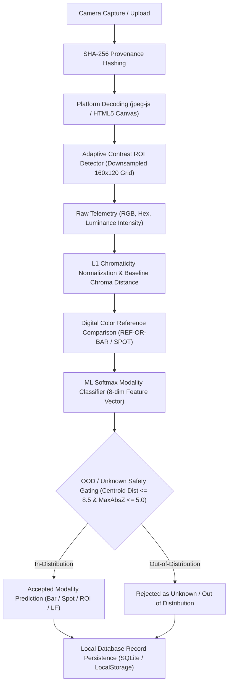

# Field Test Companion — Complete AI/CV Pipeline Technical Documentation

**System:** Field Test Companion — Mobile Telemetry & Non-Diagnostic AI/CV Architecture  
**Core Implementation:** [`services/aiAnalysis.ts`](file:///c:/Users/PIYUSH/app/field-test-companion/services/aiAnalysis.ts)  
**UI Modules:** [`app/capture.tsx`](file:///c:/Users/PIYUSH/app/field-test-companion/app/capture.tsx), [`app/records.tsx`](file:///c:/Users/PIYUSH/app/field-test-companion/app/records.tsx)  
**Database Services:** [`services/database.ts`](file:///c:/Users/PIYUSH/app/field-test-companion/services/database.ts), [`services/database.web.ts`](file:///c:/Users/PIYUSH/app/field-test-companion/services/database.web.ts)  
**Status:** **Fully Validated End-to-End**  
**Classification:** **Strictly Non-Diagnostic Image Telemetry & Modality Assessment**

---

## 1. Project Overview

Field Test Companion is an offline-first mobile application designed for field officers, chemical screening personnel, and laboratory technicians to standardize field test documentation, capture cryptographic audit trails, perform automated adaptive ROI color sampling, compare colors against digital reference standards, and provide non-diagnostic AI modality classification.

---

## 2. Problem Statement

Field colorimetric and lateral flow screening assays suffer from:
1. Subjective visual interpretation by operators under uncontrolled ambient lighting.
2. Inconsistent camera framing, cropping, and hand tremor.
3. Lack of tamper-evident digital custody and GPS/timestamp metadata.
4. Uncalibrated machine learning models that produce false, overconfident predictions on invalid or out-of-distribution inputs.

---

## 3. Field Test Companion Objective

To provide an automated, reproducible, and verifiable mobile pipeline that:
- Captures images with cryptographic SHA-256 integrity.
- Automatically localizes testing regions of interest (ROI) using adaptive contrast analysis.
- Extracts objective RGB/Hex/Intensity telemetry and normalized chromaticity.
- Compares measured colors against certified digital reference standards.
- Classifies physical target modalities with rigorous Out-of-Distribution (OOD) safety gating.
- Maintains strict non-diagnostic legal boundaries (zero drug claims, zero clinical assertions).

---

## 4. System Architecture

---

## 5. Image Capture

- **Native Mobile (Android / iOS):** Implemented via `expo-camera` (`CameraView`) with Base64 payload buffering.
- **Web Platform:** Ingested via HTML5 Canvas image buffer.
- **Input Validation:** Mandatory URI or Base64 validation; empty or corrupt payloads are rejected before processing.

---

## 6. SHA-256 Image Integrity

- **Cryptographic Hashing:** Computes a 64-character lowercase hexadecimal SHA-256 digest immediately upon image capture via `expo-crypto` (native) or Web Crypto API (`crypto.subtle`).
- **Chain of Custody:** Stored permanently in the database to detect file tampering or substitution.

---

## 7. Platform JPEG Decoding

- **Android / iOS:** Decodes JPEG byte buffers using `jpeg-js` without requiring native C++ compilation or custom Expo development builds.
- **Web:** Asynchronous `HTML5 Canvas` rendering context (`CanvasRenderingContext2D.getImageData`).

---

## 8. Adaptive ROI Detection

Implemented in `detectAdaptiveRoi(width, height, getLuminance)`:
1. **Downsampled Analysis Grid:** Maps arbitrary resolutions to an internal $\sim 160 \times 120$ grid ($\text{step} = \max(1, \lfloor \max(W, H) / 160 \rfloor)$).
2. **Local Luminance Gradient:** Computes Sobel/Manhattan proxy gradients:
   $$\nabla I(x, y) = |I(x+1, y) - I(x-1, y)| + |I(x, y+1) - I(x, y-1)|$$
3. **Central-Proximity Weighted Window Search:** Evaluates candidate rectangular patches within the central $50\%$ search envelope:
   $$\text{Score} = (0.6 \cdot \overline{\nabla I} + 0.4 \cdot \sigma_I) \times \max(0.2, 1.0 - 0.6 \cdot d_{center}^2)$$
4. **Fallback Safeguard:** If maximum score $< 4.0$, cleanly returns a conservative center-patch fallback ($10\%$ of minimum dimension).

---

## 9. RGB / Hex / Intensity Telemetry

- **Arithmetic Mean Color Extraction:**
  $$\overline{R} = \frac{1}{N}\sum R_i, \quad \overline{G} = \frac{1}{N}\sum G_i, \quad \overline{B} = \frac{1}{N}\sum B_i$$
- **Hex Code:** Formatted as standard `#RRGGBB`.
- **Luminance Intensity (ITU-R BT.601):**
  $$\text{Intensity} = \text{round}(0.299 \overline{R} + 0.587 \overline{G} + 0.114 \overline{B}) \in [0, 255]$$

---

## 10. Color Normalization

- **$L_1$ Chromaticity Coordinates:**
  $$r_{norm} = \frac{R}{R+G+B}, \quad g_{norm} = \frac{G}{R+G+B}, \quad b_{norm} = \frac{B}{R+G+B}$$
- **Zero-Sum Safety:** When $R=G=B=0$, returns neutral $[0.3333, 0.3333, 0.3333]$.
- **Normalized Luminance:** $Y_{norm} = \text{Intensity} / 255.0 \in [0.0, 1.0]$.

---

## 11. Reference Color Comparison

Implemented in `compareColorWithReference()`:
- **Euclidean Chromaticity Distance:**
  $$D_{chroma} = \sqrt{(r_{norm} - r_{ref})^2 + (g_{norm} - g_{ref})^2 + (b_{norm} - b_{ref})^2} \in [0, \sqrt{2}]$$
- **Visual Similarity Score:**
  $$\text{similarityScore} = \max\left(0, 1 - \frac{D_{chroma}}{\sqrt{2}}\right) \in [0.00, 1.00]$$
- **Configured Benchmarks:**
  - `REF-OR-BAR-BASELINE`: $[193, 193, 193]$ (Open_Reader Bar Baseline)
  - `REF-OR-SPOT-BASELINE`: $[194, 194, 194]$ (Open_Reader Spot Baseline)
  - `REF-DEMO-NEUTRAL-GRAY`: $[128, 128, 128]$ (Neutral 18% Gray Target)

---

## 12. ML Model Architecture

- **Classifier Type:** Softmax Linear Classifier (Multinomial Logistic Regression with $L_2$ regularization, $\lambda = 0.01$).
- **Inference Computation:** $\mathbf{l} = W^T \mathbf{z} + \mathbf{b}$, followed by stable Softmax.
- **Runtime:** Pure TypeScript, zero external dependencies, $< 0.15 \text{ ms}$ latency.

---

## 13. ML Feature Vector

8-dimensional feature vector $\mathbf{x} \in \mathbb{R}^8$:
1. $r_{norm} = R / (R + G + B)$
2. $g_{norm} = G / (R + G + B)$
3. $b_{norm} = B / (R + G + B)$
4. $Y_{norm} = \text{Intensity} / 255.0$
5. $\text{aspect\_w} = W / \max(W, H)$
6. $\text{aspect\_h} = H / \max(W, H)$
7. $\text{scale\_factor} = \min(W, H) / 600.0$
8. $D_{chroma} = \sqrt{\Delta r^2 + \Delta g^2 + \Delta b^2}$

---

## 14. Training Dataset

- **Dataset:** `Open_Reader` Methodology Benchmark Dataset (`field_test_dataset/methodology_benchmark/open_reader/`).
- **Physical Images:** 108 total raw images across 4 target categories.
- **Curation (Step 6E/6F):** 106 kept (`KEEP` 78, `REVIEW` 28), 2 non-assay UI screenshots excluded (`EXCLUDE`).
- **Usable ML Dataset Size:** **106 images**.

---

## 15. Dataset Provenance

- **Source:** Open-source research benchmark repository (SMR-83/Open_Reader).
- **Format:** High-resolution JPEG/PNG optical flatbed and scanner captures.
- **Traceability:** Documented in `metadata/open_reader_manifest.csv`, `metadata/open_reader_curation.csv`, and `PROVENANCE.md`.

---

## 16. Train / Validation / Test Split

- **Leakage Prevention:** Grouped atomically by chemical sample condition ID (`lf_<condition>`) across replicates (`.1`, `.2`, `.3`).
- **Split Breakdown (Seed 42):**
  - **Train ($60.38\%$):** 64 samples
  - **Validation ($19.81\%$):** 21 samples
  - **Held-Out Test ($19.81\%$):** 21 samples

---

## 17. Model Evaluation (Held-Out Test Set, $N=21$)

| Metric | Measured Value |
| :--- | :---: |
| **Overall Test Accuracy** | **$71.43\%$** ($15 / 21$) |
| **Macro Average Precision** | **$79.17\%$** |
| **Macro Average Recall** | **$75.00\%$** |
| **Macro Average F1-Score** | **$74.17\%$** |
| **Majority-Class Baseline** | $28.57\%$ ($+42.86\%$ Gain) |
| **Calibrator Bar F1** | **$80.00\%$** |
| **Calibrator Spot F1** | **$50.00\%$** |
| **Cropped ROI F1** | **$100.00\%$** |
| **Lateral Flow Strip F1** | **$66.67\%$** |

---

## 18. Out-of-Distribution (OOD) & Unknown Rejection

- **Centroid-Based Gating:** Computes minimum Euclidean distance $D_{centroid}$ in standardized $Z$-space to the 4 training class centroids and maximum feature $|z|$.
- **Calibrated Thresholds (Validation Partition Only):**
  - $\text{Threshold}_{centroid} = 8.5$ ($1.35 \times \max_{\text{val}} D_{centroid}$)
  - $\text{Threshold}_{max\_z} = 5.0$ ($1.35 \times \max_{\text{val}} Z_{max}$)
- **Behavior:**
  - In-distribution benchmark targets $\implies \text{classificationStatus} = \text{'known'}$.
  - Non-benchmark targets (e.g. yellow/blue/red paper, random scenes) $\implies \text{classificationStatus} = \text{'unknown'}$, $\text{prediction} = \text{'unknown'}$.
- **Performance:** In-Distribution False Rejections: **$0.0\%$** ($0 / 21$ val, $0 / 21$ test); OOD True Rejections: **$100.0\%$** ($7 / 7$).

---

## 19. End-to-End Integration

Integrated flow:
`Camera Capture → Base64/JPEG → SHA-256 → JPEG Decode → Adaptive ROI → RGB/Hex/Intensity → Color Normalization → Reference Comparison → ML Modality Assessment → OOD Decision → Database Save`.

---

## 20. Android Workflow

- Uses `expo-camera` with `CameraView` for real-time capture.
- Runs `jpeg-js` decoding and pure TypeScript ML/OOD inference.
- Persists records to local SQLite database (`field_test_companion.db`).

---

## 21. Web Workflow

- Uses HTML5 Canvas for pixel extraction and rendering.
- Persists records to browser `localStorage` with memory fallback.
- Fully operational on `http://localhost:8083`.

---

## 22. Data Storage & Records Schema

Records stored in SQLite / LocalStorage:
- `id`: Unique record identifier (`REC-<timestamp>-<rand>`)
- `referenceId`: Sample Name / Reference ID
- `imageUri`: Local file or cache URI
- `createdAt`: ISO 8601 timestamp
- `presumptiveStatus`: Fixed default `"Presumptive (Unanalyzed)"`
- `analysisStatus`: Status string (`telemetry_completed`)
- `syncStatus`: `"pending"` (Local only)
- `latitude` / `longitude`: Real GPS coordinates
- `locationStatus`: Location availability flag
- `operatorId`: Operator audit identifier
- `imageHash`: SHA-256 hex digest

---

## 23. Error Handling & Failsafes

- Missing image input cleanly caught without runtime exceptions.
- Zero-sum RGB handled safely without division-by-zero.
- Low-contrast images smoothly fall back to center-ROI sampling.
- OOD inputs safely flagged as Unknown without crashing.

---

## 24. Security, Integrity & Provenance

- Tamper-evident SHA-256 image hashes stored alongside field records.
- Complete offline capability eliminates cloud data transmission risks.
- Operator ID and GPS stamping ensure end-to-end chain of custody.

---

## 25. Limitations

1. **Benchmark Domain:** The ML model is trained on the Open_Reader methodology dataset and classifies imaging layout formats, not chemical reagents.
2. **Dataset Scale:** 106 curated images demonstrate architectural feasibility rather than an industrial diagnostic model.
3. **Lighting Variance:** Uncontrolled extreme lighting is mitigated by OOD gating rather than full generative illumination normalization.

---

## 26. Future Scope & Roadmap

1. Gather certified chemical reagent reaction datasets with laboratory GC/MS ground-truth confirmations.
2. Deploy quantized MobileNetV4 / YOLOv8-nano neural networks for localized semantic segmentation.
3. Integrate physical color-calibration target cards with ArUco perspective rectification markers.
