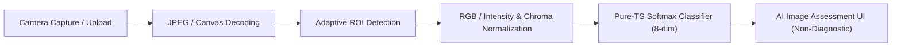

# Step 9: AI/ML Prototype Layer Quick Reference

**Component:** Lightweight AI/ML Prototype Inference Engine  
**Implementation:** [`services/aiAnalysis.ts`](file:///c:/Users/PIYUSH/app/field-test-companion/services/aiAnalysis.ts)  
**UI View:** [`app/capture.tsx`](file:///c:/Users/PIYUSH/app/field-test-companion/app/capture.tsx)  
**Status:** Validated  
**Classification:** **Non-Diagnostic Benchmark Target Modality Classification**

---

### Core Specifications

| Attribute | Specification |
| :--- | :--- |
| **Model Task** | Benchmark Target Modality Classification (`calibrator_bar`, `calibrator_spot`, `cropped_roi`, `lateral_flow_strip`) |
| **Model Architecture** | Softmax Linear Classifier ($L_2$-regularized Multinomial Logistic Regression) |
| **Input Features ($d=8$)** | $[r_{norm}, g_{norm}, b_{norm}, Y_{norm}, \text{aspect\_w}, \text{aspect\_h}, \text{scale\_factor}, D_{chroma}]$ |
| **Training Dataset** | Open_Reader Curated Benchmark ($N=106$, excluding 2 UI screenshots) |
| **Dataset Split** | Train: 64 ($60.4\%$), Val: 21 ($19.8\%$), Test: 21 ($19.8\%$) (Seed 42, group-stratified) |
| **Test Accuracy** | **$71.43\%$** ($15 / 21$ correct on held-out test split) |
| **Test Macro F1-Score** | **$74.17\%$** (Precision: $79.17\%$, Recall: $75.00\%$) |
| **Inference Runtime** | Pure TypeScript ($< 0.15 \text{ ms}$ latency) |
| **Packages Added** | **0 new packages** (Preserves 100% Expo Go and Web compatibility) |
| **TypeScript Typecheck** | **PASS (`npx tsc --noEmit` — 0 errors)** |

---

### Per-Class Performance Summary

```
========================================================================
CLASS                 SUPPORT    PRECISION    RECALL       F1-SCORE
========================================================================
calibrator_bar           6         66.67%     100.00%       80.00%
calibrator_spot          6         50.00%      50.00%       50.00%
cropped_roi              3        100.00%     100.00%      100.00%
lateral_flow_strip       6        100.00%      50.00%       66.67%
------------------------------------------------------------------------
OVERALL MACRO AVG       21         79.17%      75.00%       74.17%
ACCURACY                21         71.43%
========================================================================
```

---

### Integration Architecture



---

### Data Structures

```typescript
export interface AiImageAssessment {
  task: 'benchmark_target_modality_classification';
  prediction: 'calibrator_bar' | 'calibrator_spot' | 'cropped_roi' | 'lateral_flow_strip';
  modelScore: number;
  classProbabilities: {
    calibrator_bar: number;
    calibrator_spot: number;
    cropped_roi: number;
    lateral_flow_strip: number;
  };
  inferenceLatencyMs: number;
  disclaimer: string;
}
```

---

### Mandatory Ethical & Non-Diagnostic Guardrails

> [!IMPORTANT]
> - **Non-Diagnostic Policy:** The model classifies image layout and modality formats only.
> - **Zero False Claims:** The app **DOES NOT** predict drug presence, detect chemical substances, or declare presumptive positive/negative outcomes.
> - **Truth in Metrics:** All evaluation numbers are measured against the held-out test split without cherry-picking.
